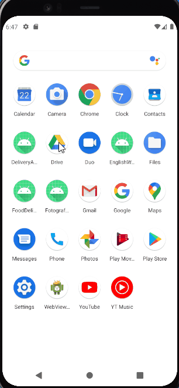
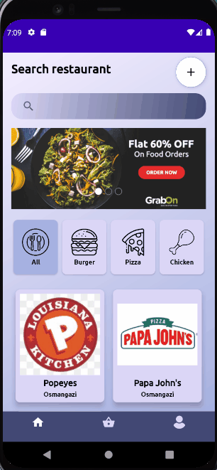
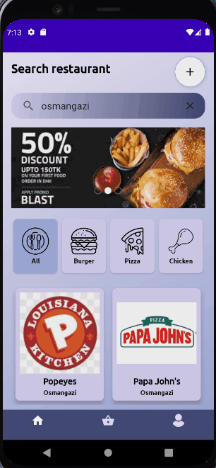
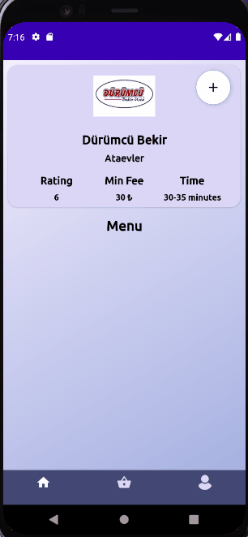
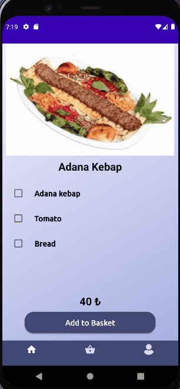
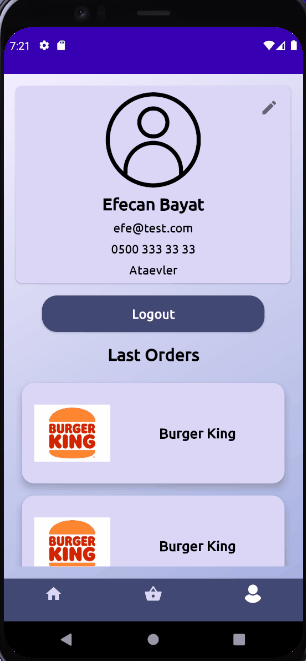

# Yemeksepeti Mobile Android Bootcamp Final Project.

## About this project

This project is a food delivery application. In this project I learned the most used structures in android applications.

## Used Technologies

* MVVM Architecture
* Retrofit, okHttp
* Dagger Hilt
* Kotlin Coroutine
* ViewModel - LiveData
* Gson
* Lottie Animations
* RecyclerView
* Fragments
* Room
* JWT Decode

## Project Structure
------
* Splash Screen
* Onboarding Screens
* Login Screen
* Register Screen
* Home Screen
* Add Restaurant Screen
* Restaurant Detail Screen
* Add Food Screen
* Food Detail Screen
* Order Basket Screen
* Profile Screen
* Update User Screen
* Last Orders Screen

### Screen Usage
-----

#### Splash, Onboarding, Login Screens
-----

#### Home Screen
-----

* Restaurant List
* Restaurants can be search by name and district
* Restaurants can be filtered by category

#### Restaurant Add Screen
-----

* Add button only appears for admin users

#### Food Add Screen
-----

* Add button only appears for admin users

#### Order Card Screen
-----

* Clear button cleans the order card
* Order button send orders to last orders at profile screen

#### Profile, Update User, Last Orders Screens
-----

## Acknowledgements

- Kodluyoruz Yemeksepeti Android Bootcamp
- Patika.dev 
- [Erol Kaftanoğlu](https://github.com/erolkaftanoglu)
